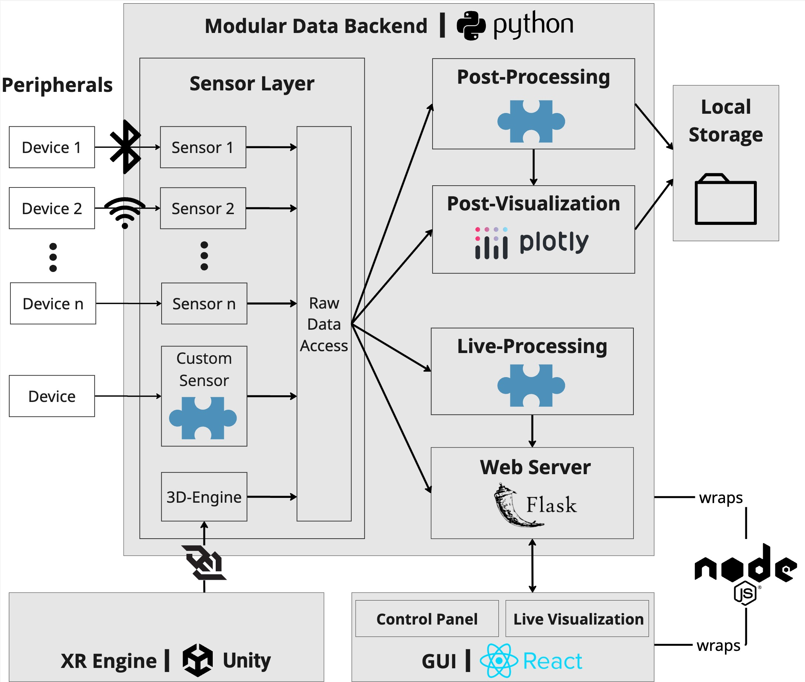
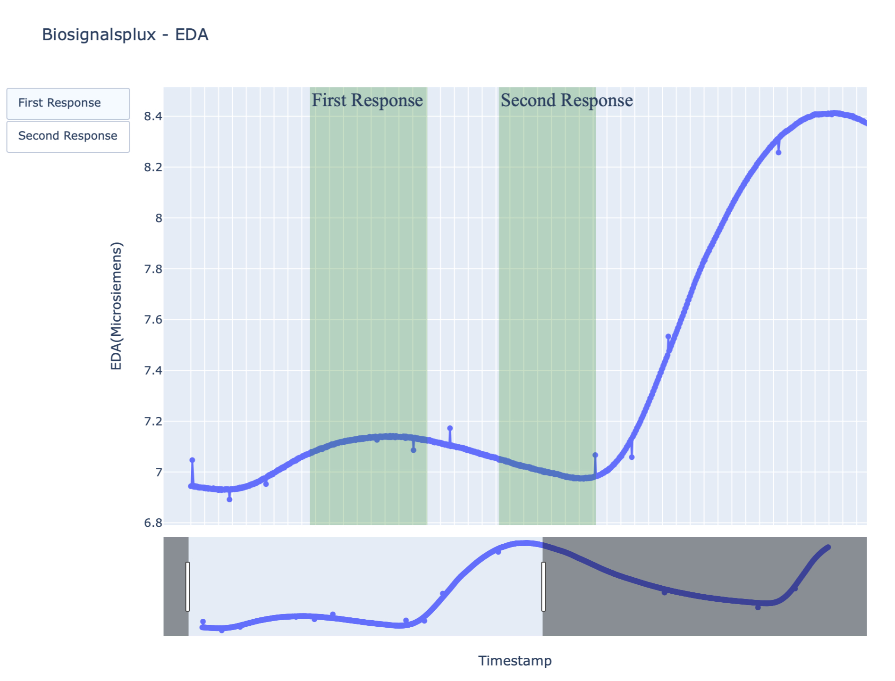
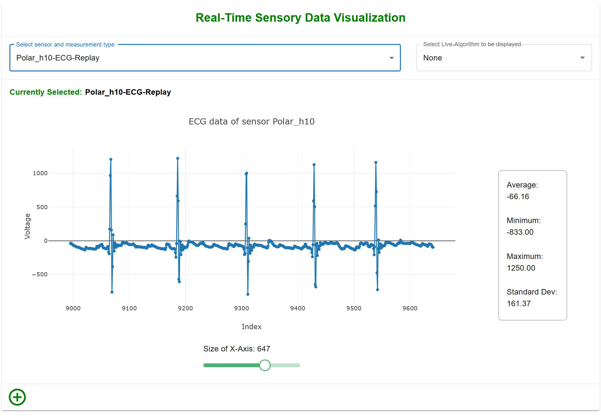

# Measurement Engine – Additional Images

Visuals from the Measurement Engine project:

  
*Partial data flow diagram of the Measurement Engine. Peripheral devices stream data into the data backend. The raw data is passed to live-processing algorithms. A web server exchanges both raw and processed data with the GUI. Once a recording session ends, the collected raw data is further processed using post-processing algorithms. Both raw and processed data are visualized and saved locally. The XR engine (Unity in this case) is integrated as a sensor and can stream additional sensor data (e.g., gyroscope or eye tracking) as well as the onset of events that are useful for data visualization and processing. The blue puzzle pieces indicate specific extension points where the engine offers predefined workflows for modular expansion.*

  
*Example HTML-based visualization of EDA raw data collected with a Biosignalsplux device. The two green-highlighted areas indicate the time intervals defined by the events happening in the XR-Engine. The two buttons on the left side of the graph allow zooming in on the data corresponding to each respective response period. The two sliders at the bottom allow users to define the start and end of the displayed range. The measurement engine automatically creates these graphs for all collected data. Users can also integrate their own algorithms, which can be applied only to the data in the intervals marked in green, for example. The timestamps that usually label the X-axis have been cropped out in this view..*

  
*Live visualization of a data stream in the Measurement Engine. Two dropdown menus at the top allow users to select either raw data streams or processed data. The central graph displays ECG data from a Polar H10 chest strap. The slider below the graph lets users adjust the amount of data shown at a time. By clicking the plus button in the bottom-left corner, users can add an additional live graph.*